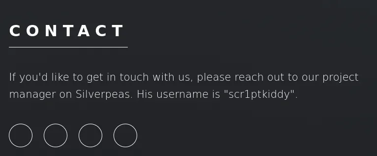
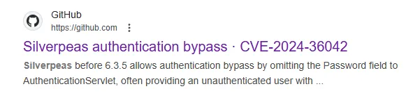
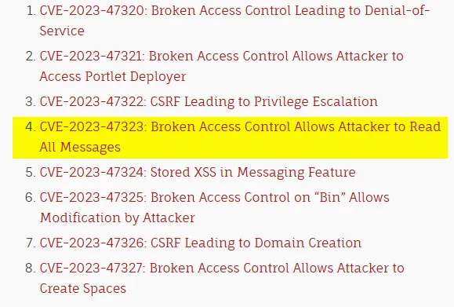
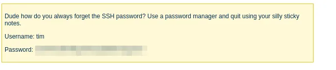
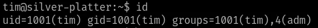
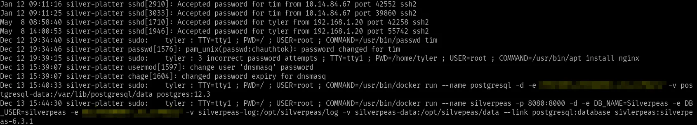
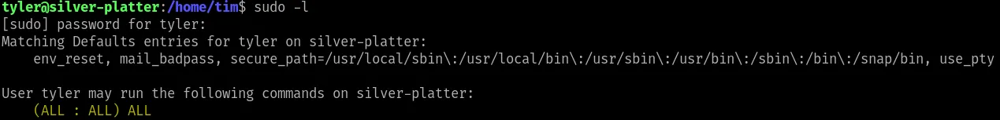

# Silverpeas Exploitation - TryHackMe Write-up

## 🎯 Objectif
Ce dépôt documente la résolution d'une room TryHackMe ciblant l'application **Silverpeas**. L'objectif est d'enchainer plusieurs CVEs (Auth Bypass, Information Disclosure) pour obtenir un accès initial, puis d'exploiter une mauvaise configuration des permissions de groupe (`adm`) et des droits `sudo` pour devenir **root**.

**Compétences démontrées :**
* **Reconnaissance Web** (Identification de version & Endpoints).
* **Recherche & Exploitation de CVE** (Auth Bypass & IDOR/SQLi).
* **Manipulation de requêtes HTTP** (Burp Suite).
* **Énumération Système** (Analyse des groupes et des logs).

---

## 🔍 1. Reconnaissance Web

### Scan de ports & Découverte
Le scan Nmap initial révèle les ports **80** et **8080** ouverts.
En visitant le port 80, nous trouvons un site web standard. Cependant, le port 8080 renvoie une erreur par défaut.
Une énumération de répertoires (Gobuster) ou une analyse du site sur le port 80 nous permet d'identifier le nom de l'application : **Silverpeas**.

Nous testons l'accès direct : `http://IP:8080/Silverpeas`, ce qui nous mène à la page de connexion de l'application.



---

## 🔓 2. Exploitation : Authentication Bypass & Data Leak

### Recherche de Vulnérabilités (CVE)
Une recherche Google "SilverPeas CVEs" nous dirige vers plusieurs failles critiques.


Nous identifions une vulnérabilité de **contournement d'authentification** (Authentication Bypass).

**Exploitation (Auth Bypass) :**
La faille réside dans le traitement de la connexion. Si le champ `password` est absent de la requête POST, le système valide la connexion.
1.  Nous capturons la requête de login avec **Burp Suite**.
   
3.  Nous supprimons le paramètre `password` du corps de la requête.
4.  Nous forwardons la requête modifiée.

 

Une fois la requête envoyée, nous désactivons l'interception et rafraichissons la page : nous sommes connectés en tant qu'administrateur.

### Obtention d'identifiants (Information Disclosure)

Nous sommes connectés en tant qu'administrateur. Cependant, l'interface d'administration ne nous offre pas d'accès direct au serveur (RCE). Nous devons trouver autre chose.


### CVE-2023-47323 : Vol d'identifiants (Information Disclosure)
Nous retournons à notre liste de CVEs. Notre objectif est d'obtenir des identifiants pour nous connecter en SSH.
La **CVE-2023-47323** attire notre attention : *"Broken Access Control Allows Attacker to Read All Messages"*. C'est le vecteur idéal pour trouver des échanges sensibles.

En modifiant l'ID dans l'URL d'une fonctionnalité de messagerie (SQL Injection ou IDOR selon la version), nous pouvons lire les messages des autres utilisateurs.


En itérant jusqu'à **ID=6**, nous découvrons un message contenant des identifiants en clair.




---

## 👣 3. Mouvement Latéral : Tim vers Tyler
*(Technique : Log Analysis via ADM Group)*

Nous nous connectons en SSH avec les identifiants de **tim**.
Une fois connecté, nous effectuons une énumération basique avant de lancer des outils automatisés.

### Analyse des groupes
La commande `id` révèle une information cruciale :

```bash
uid=1001(tim) gid=1001(tim) groups=1001(tim), 4(adm)
```


### Analyse des permissions : Le groupe `adm`
L'analyse des groupes (`id`) révèle que l'utilisateur appartient au groupe **adm (GID 4)**.
Ce groupe est privilégié : ses membres ont généralement un accès en lecture aux journaux système (fichiers dans `/var/log`). C'est un endroit stratégique pour la reconnaissance, car il contient souvent des informations sensibles ou des erreurs.

> **Note :** C'est un vecteur classique pour trouver des mots de passe enregistrés par erreur.

### Exploitation des logs
Nous listons le contenu de `/var/log` pour identifier le fichier d'authentification, puis nous utilisons `grep` pour chercher des motifs de mots de passe.

```bash
ls /var/log
cat /var/log/auth* | grep -i pass
```


`grep -i pass` : Filtre la sortie pour ne montrer que les lignes contenant "pass" (insensible à la casse). Cela permet de trouver des termes comme "password", "passwd", ou "PASS".
### Connexion et Analyse des Privilèges
Avec le mot de passe récupéré dans les logs, nous changeons d'utilisateur pour accéder au compte de **tyler** :

```bash
su tyler
```
Une fois connecté, nous vérifions immédiatement les droits sudo de cet utilisateur pour voir s'il peut exécuter des commandes en tant que root.
```bash
sudo -l
```

### Exploitation des droits Sudo
L'analyse de `sudo -l` révèle que l'utilisateur peut exécuter **n'importe quelle commande** en tant que **n'importe quel utilisateur** (souvent indiqué par `(ALL : ALL) ALL`). C'est une mauvaise configuration critique qui donne un accès total.

Pour exploiter cela et devenir **root**, il nous suffit de lancer un shell interactif avec `sudo`. Plusieurs commandes permettent de le faire :

```bash
sudo bash
# Alternatives possibles :
# sudo su
